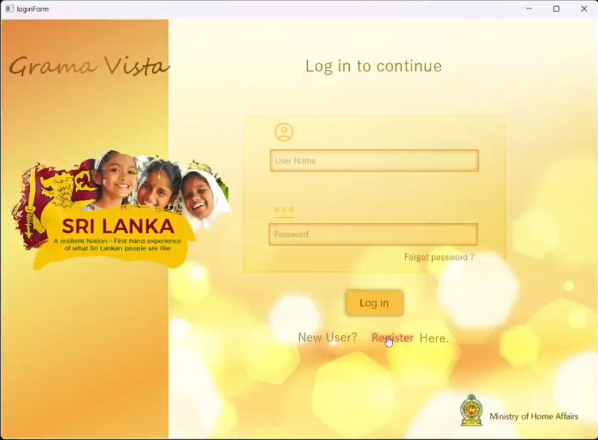
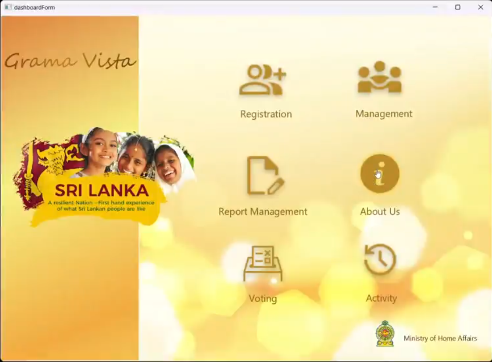
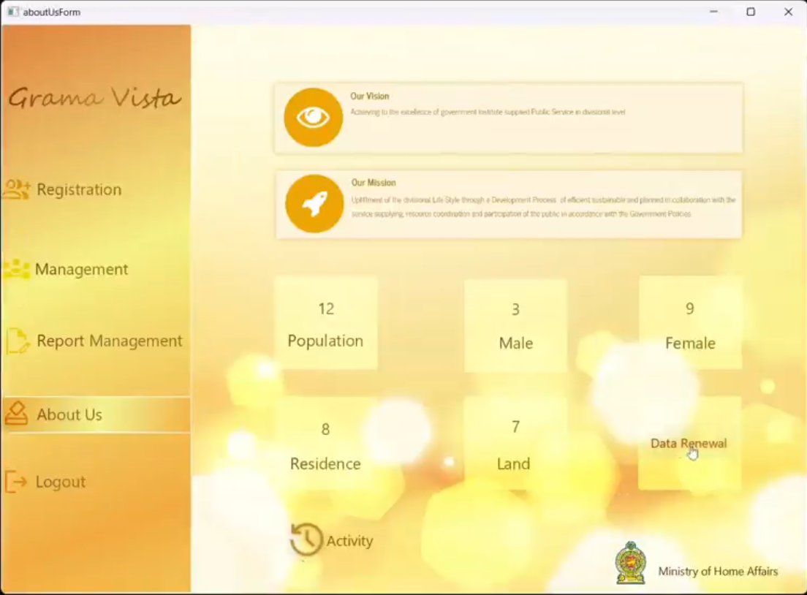
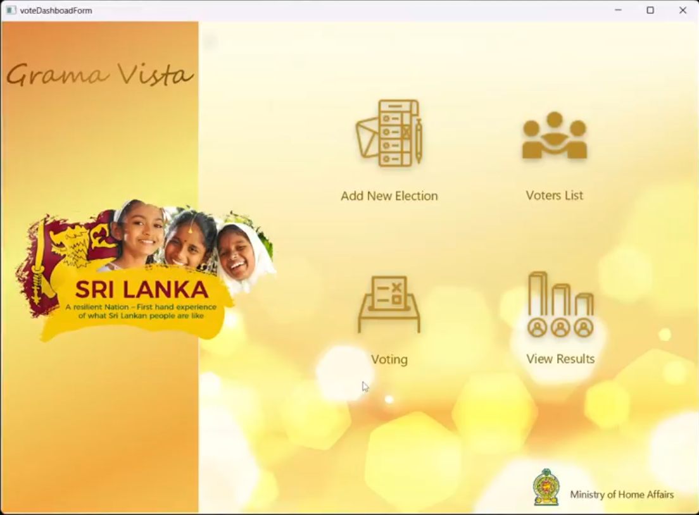
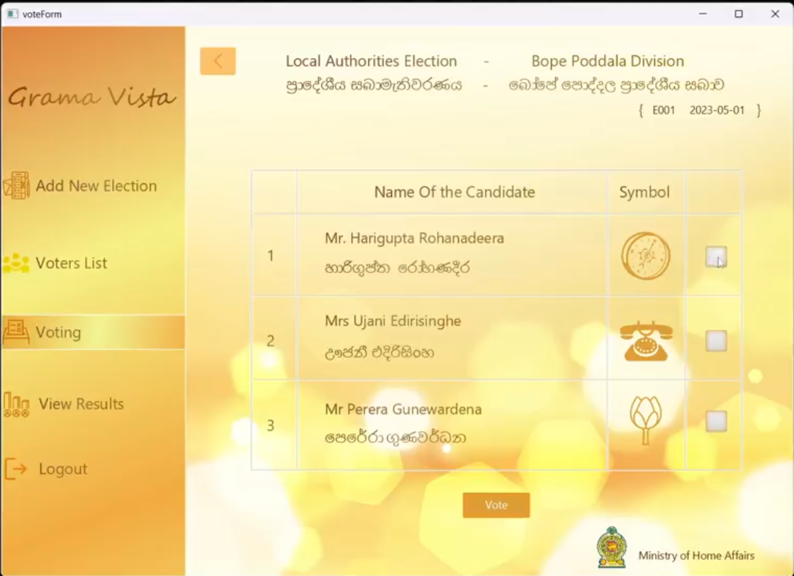
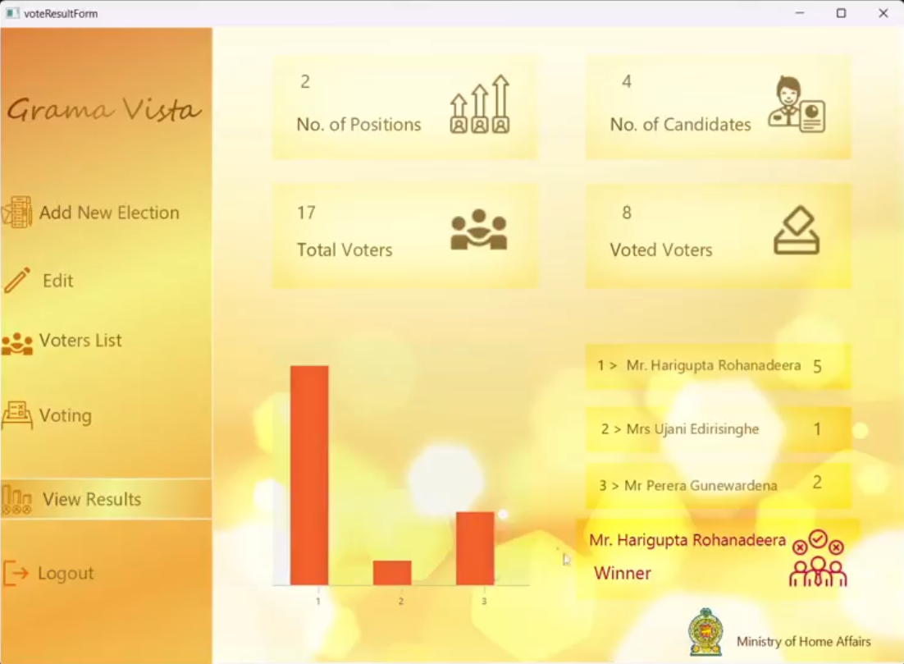

# Grama Vista - Government Civil Management System (GCMS) 🌐
Grama Vista is designed to assist Grama Niladhari officers in efficiently managing village affairs and ensuring the well-being of residents through effective civil services management. It provides a user-friendly interface for tracking and managing essential village data, with automated report generation for various government services.


## Key Features:
- Resident Management: Efficiently manage and track resident data, including personal information and property ownership.
- Property Management: Keep records of properties within the village, including ownership and transfer details.
- Deceased Management: Maintain records of deceased individuals and update resident data accordingly.
- Report Generation: Automatically generate lists for Samurdhi benefits, pensions, maternity allowances, disability allowances, and election voter registries.
- Demo Voting App: A simple demo app for conducting village-level elections.
## Technology Stack:
```markdown
✅ Java
✅ JavaFX
✅ MySQL
✅ JDBC
✅ Jasper Reports
✅ JavaMail
✅ OpenCV
```

### How to Run:
1. **Clone the Repository:**
   ```bash
    git clone https://github.com/bethmij/Grama-Vista.git
   ```

2. **Set Up the Database:**

   - Configure MySQL and set up the required database schema using the provided SQL scripts.

3. **Run the Application:**

   - Use your preferred IDE to run the Java application. Ensure all dependencies are correctly configured.
   
4. **Explore the Features:**

    - Log in as a Grama Niladhari officer and explore the various features for managing village data and generating essential reports.

- You got login, register and forgot password option where you will get verification code through email


- Dashboard represent main key features


- About us Page


- Register 8 entities here


- Demo Voting Page


- Here you can vote as you like


- Auto calculated voting results are only visible during specific time only

